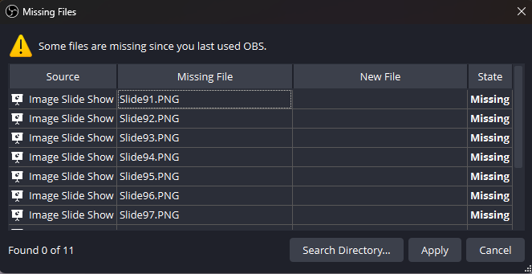
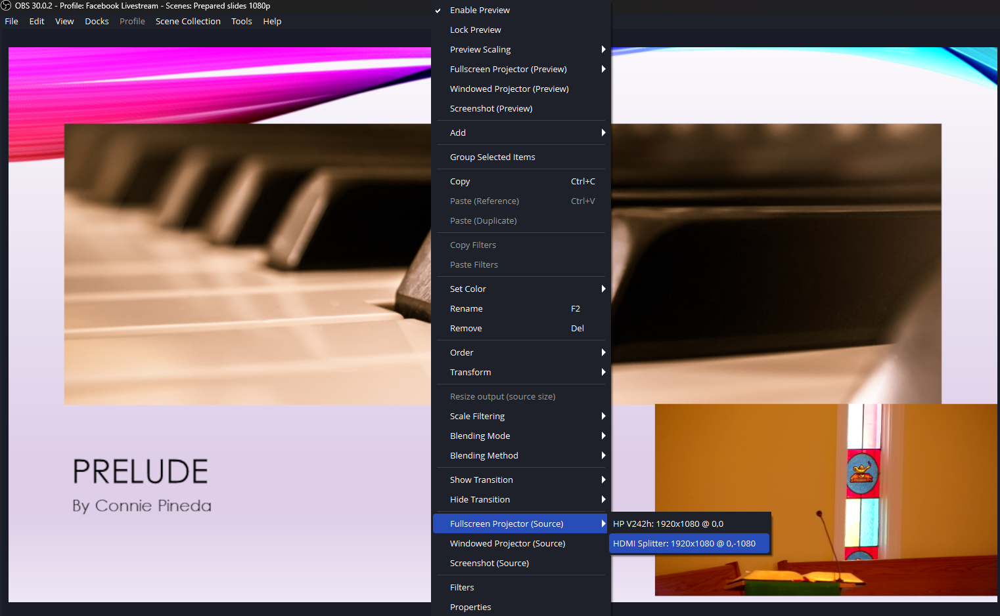
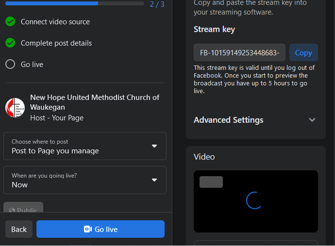
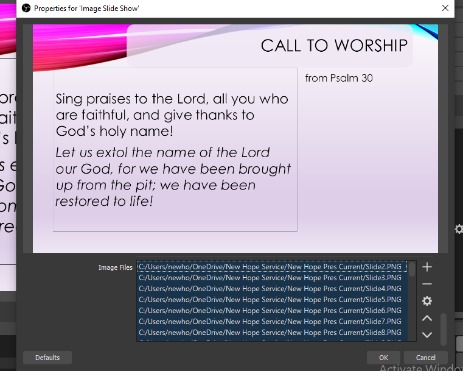
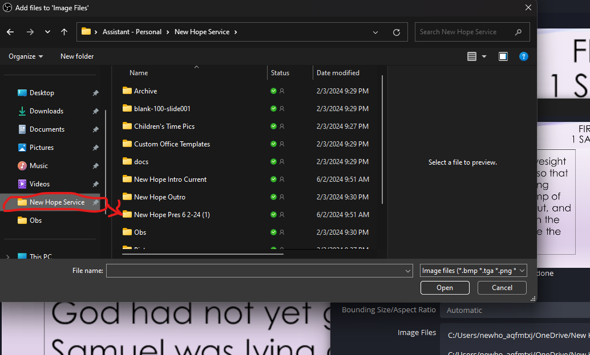
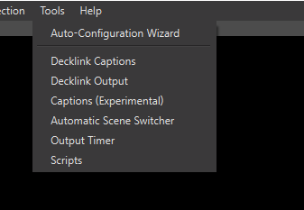
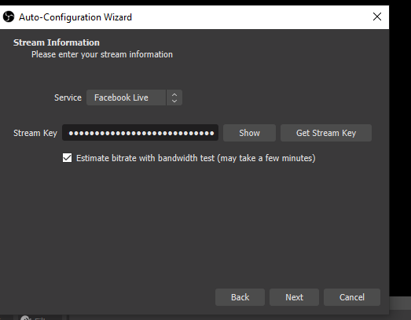

# Computer Setup & Use

The computer is the center of the operation and does require some setup weekly, but this guide will walk you through step by step.

To unlock the computer, use the code: `41460085`

## Startup

All of the programs to start are along the toolbar on the bottom. Firefox will start automatically, just wait.

## Firefox / Facebook Live

Open firefox from the toolbar and it will open to facebook live’s page. Scroll down to select the “Select” option under “Go Live”

First, Press the copy button next to Stream Key to copy the new stream key to the clipboard for later. 

## OBS

Before starting OBS, check the Onedrive icon in the bottom toolbar. If it is fully synced, you can start OBS. Start the second from the right program on the toolbar, OBS.

### Missing Files

On start up it will list missing files, you can use this to select all the powerpoint slides if they aren't more than the missing files. 

Click "Search Directory" and then select the current dates folder in the New Hope Service Folder (Pinned on the side)

It will say something like "49 out of 100" found. if the first number is the same as the second, you will have to reset the slides as it may be missing some above that second number. Jump to Set Powerpoint Slides.

**REMEMBER** to check if the "Slides found" listed less that total found. If it is not you may be missing slides at the end.

### Set Projector Output

Next, right click the main video view in the center and select fullscreen projector and the output shown:

### Start Stream

Go to Settings>Stream and set the "Stream Key" to the key you copied from facebook.

Finally, select “2) Intro” and in the upper right of the screen select start stream to connect to facebook, and go back to facebook and select “Go Live” to start the stream:

Afterwards, you can return to OBS to run the stream. Remember to press 'm' to unmute the audio system sound to the stream when service starts.

### Set Powerpoint Slides (Optional)

On the side toolbar, select the “4) Powerpoint” Option and then, in the Sources section next to it, find and double click the “Image Slideshow” hand side to get to the properties to set the images for the powerpoint.

Scroll down to the list of images in the slide show, select the first one and press [Ctrl+a] to select all of them. Press the “-“ option on the left to clear them all and then press the “+” and select "files" to add the new images.

Go in to the current date's presentation Folder which should open by default, and select all but the first slide from that folder by selecting the first image, pressing [Ctrl+a], and then holding [Ctrl] while clicking the first image again. Finally, select open and click ok in the image slideshow to complete selection.

To reset it to work with the missing files instead, set the slides to all of the slides in the blank-100-slides folder and then move the folder. This will trick obs into see 100 "missing" files for you to search for.

### Set Video (Optional)

If the pastor instructs you to use a video during service, you will find the video in the New Hope Service folder under Skits in a folder named for the video. Select “6) Skit Media” and then select the “Video Source” option. Browse for the video and select it to set it. When playing the video, you must unmute the Realtek Audio speakers and raise the volume of `Input 1` on the soundboard to have it play in the sanctuary.

### Set Music (Optional)

If the pastor instructs you to use a video during service, you will find the video in the New Hope Service folder under Skits in a folder named for the video. Select “4) Powerpoint” and then select the "Music Source” option. Browse for the music and select it to set it. When playing the video, you must unmute the Realtek Audio speakers and raise the volume of `Input 1` on the soundboard to have it play in the sanctuary, then press [p] to restart it and [Shift+p] to stop it.

### Auto Config Wizard (Optional)

If the stream has been performing badly, this can help reset the stream settings. Go to Tools>Auto-Config Wizard on the top bar to prep the stream:

Inside of this, click ok until you reach the option for stream key. Double-click to higlight the current key and paste to replace with the new one from facebook.

Click next and agree and wait for it to set the new setting. Click through any dialogs as needed.

## OBS Hotkeys To Use

I’ve set up hotkeys/shortcuts to use while running OBS. To allow the powerpoint clicker to use them, they are Always Active even when in firefox or other programs as a heads up. The hotkeys are:

- 1-7 - each of the scenes marked with a number can be switched to with the number keys as needed. Normally swapping between 3 and 4 during service.
    - Use 2 for the intro before turning on mics or before service starts
    - Use 5 after service or simply leave the camera running until end of stream
    - Use 6 to play a preset video during service with sound on the TVs
- (not currently included) v - Set the tv output to black. Setting the screens to black can be helpful on initial set up. Make sure to unset it later for service.

- b - Switch between camera and powerpoint view for the TVs. Also used by the powerpoint clicker.
- m - Mute/Unmute the input from the sanctuary.
- p - restart music loaded 
- Shift+p - stop music loaded 
- < - Used to move backward in the powerpoint.
- \> - Used to move forwards in the powerpoint
