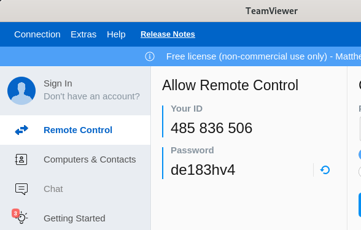

# New Hope UMC Streams Intro

[download as pdf](nhstream.pdf)

Hello, and thank you for agreeing to help with setting up our weekly streams for New Hope UMC. This guide will quickly run through the steps to setting up the stream and also any issues that may arise from the stream. Each page of this guide is in order to go step by step in the weekly setup for the stream.

## Call Time

Please always attempt to arrive 30 minutes before church to begin set up.

## Teamviewer / Troubleshooting

If you ever have a problem on the main computer that you cannot solve, press the windows key, search for ‘teamviewer’ and open it. The program will open to a screen with an ID and a password:

Send this ID and password to Matthew Fallon and he can login to the computer from anywhere and help to diagnose the problem with you.