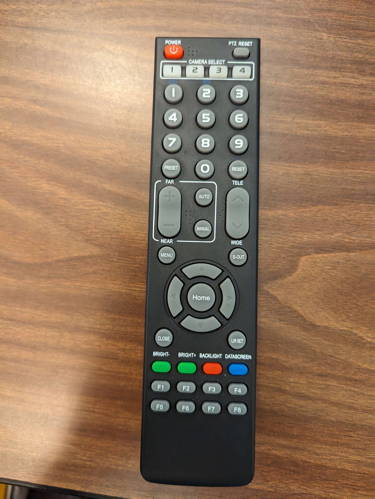

# Jobs During Service

During service, here is a list of the jobs that you can split up between various helpers as needed to keep the show running, and descriptions of each. At a bare minimun you will need two people.

1. A Camera controller to run the ptz camera and zoom in on the action.
2. Someone to control the computer and run the powerpoint.
3. Someone to listen to the sound output and manage the sound board (optional)
4. Someone to run the powerpoint separately (optional)

Beyond the first two, the other roles are optional but will make the job easier and can be given out to anyone easily to help. Each role is described below.

## PTZ (Pan Tilt Zoom) Camera

This role can often be filled by the same person controlling the powerpoint if needed. For custom angles the `Tele/Wide` corresponds to zoom while the arrow keys pan the view. However, the preset numbers 1-9 correspond to most common views throughout the church.

1. Lectern - Liturgist
2. Pulpit - Pastor
3. Front of Altar - Communion and offering
4. Dan's Sermon Seat
5. Front of house - Sermon and benediction
6. Choir and childrens time area
7. Stained glass 
8. Choir on altar
9. Full Sanctuary zoomed out

## Computer

All other jobs will center around this person often. A separate page will be used to describe the role more fully, but during service this role will be setting up the service.

You will also be responsible for any other roles that need help and coordinating where possible hence this role will often need to be someone older to step in and help if necessary.

## Powerpoint Clicker

This person will be given a print out of the presentation and a powerpoint clicker:

The left and right buttons will advance the powerpoint forwards and backwards as expected. (When the program is up on the computer screen) The top button will switch the tvs between full screen camera and powerpoint mode to allow you to switch whenever you feel having a better zoom on the camera would be best (during the sermon is a good time)