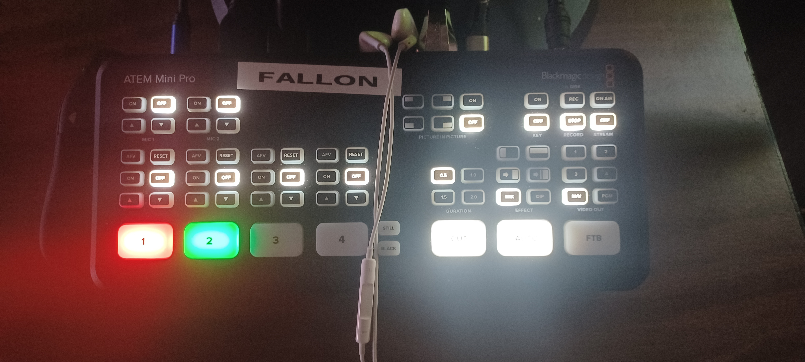
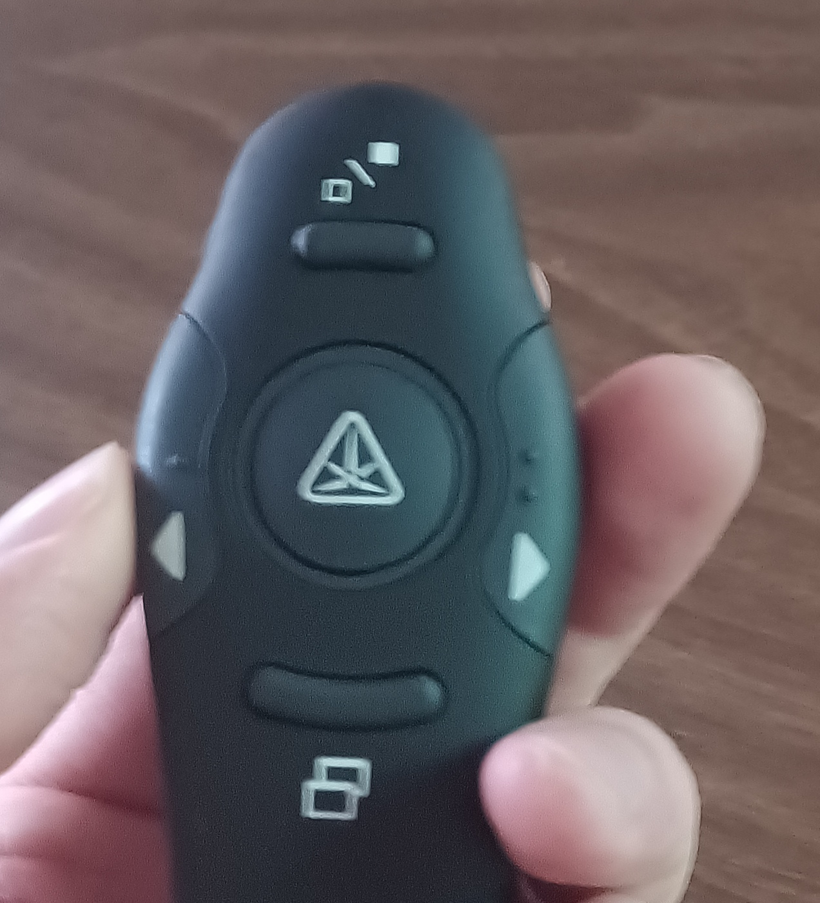

# Jobs During Service

During service, here is a list of the jobs that you can split up between various helpers as needed to keep the show running, and descriptions of each. At a bare minimun you will need two people.

1. A Camera controller to run the moving camera and zoom in on the action.

2. Someone to control the computer and the additional tech.

Beyond these two, the other roles are optional but will make the job easier and can be given out to anyone easily to help. Each role is described below.

## The Camera

This person will just need to keep the main shot camera zoomed in on the action, and zoom out and in as needed to switch between pulpits and the altar throughout the service. Always try to be ready for your camera to be on screen when possible.

- When moving the camera, slowly zoom out and then back in to perform a smooth pan between shots.
- Always try to keep the center of the action in the center of the screen (people’s faces should be near the center of the frame for the best shot)

## Computer

All other jobs will center around this person often. A separate page will be used to describe the role more fully, but during service this role will be using the “3” and “4” keys to switch between a full camera view and a powerpoint view with the camera in the corner.

You will also be responsible for any other roles that need help and coordinating where possible hence this role will often need to be someone older to step in and help if necessary.
Stream Board

There are only a few keys on the stream board shown here:

### Video Controls

Along the bottom row there is a button labelled “Auto.” This button will swap from the input that is currently red and the input that is green on the board. On the screen above, the two inputs will be displayed. The video feed on the right is the currently live feed going to the computer while the other feed is a preview to help you know when to switch. You will switch off of the main camera when it is moving to give a wide shot, and switch back when the shot is ready and zoomed in.

### Audio Controls

Also, you will be in control of sound for the service. To turn on the sound from the main mic, press the on key in the very top left hand corner. Once on, you can adjust the level of sound with the up and down arrow buttons below that on button. To monitor the sound you will wear the earbuds.

Before service, perform a sound check by turning the sound on before streaming. Adjust the volume and if the sound keeps making a crackling sound, ask the computer person to “restart OBS” due to the sound issues. During service, if the volume gets to high or too low, the sound will cut in and out, raise or lower the volume accordingly to match this.

## Powerpoint Clicker

This person will be given a print out of the presentation and a powerpoint clicker:

The left and right buttons will advance the powerpoint forwards and backwards as expected. The top button will switch the tvs between full screen camera and powerpoint mode to allow you to switch whenever you feel having a better zoom on the camera would be best (during the sermon is a good time)