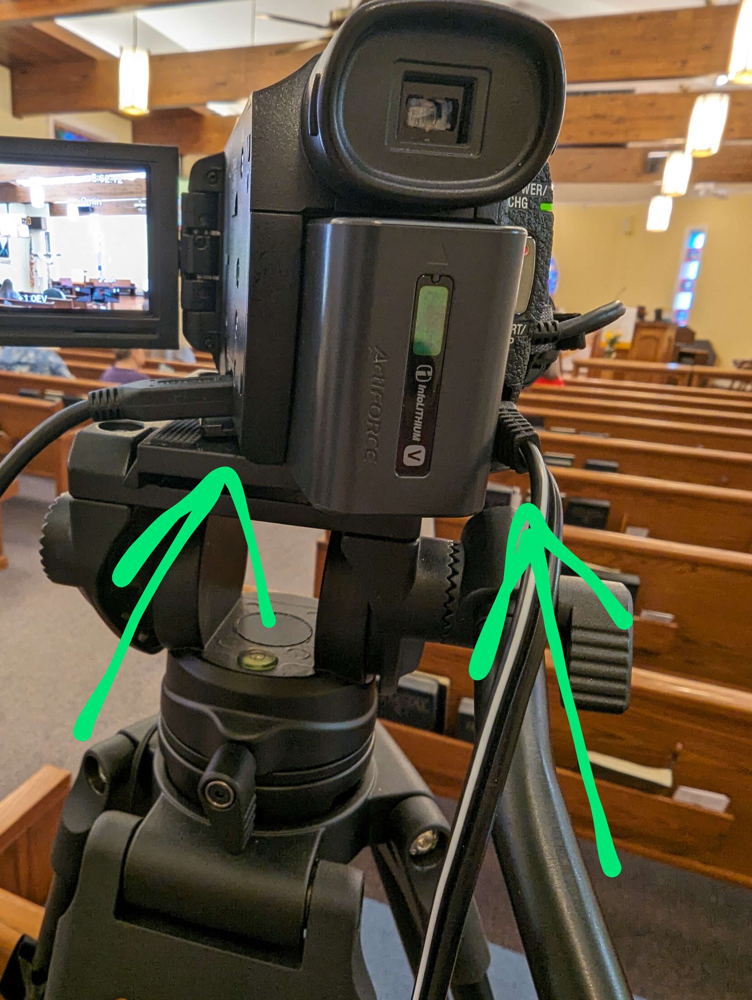

# Powering On

On arrival, here is a list of devices to power on in order to start the stream.

## Surge Protector

Under the computer there is a switched surge protector. Turn on the top switch to turn on all the plugs.

## Headphones (Bluetooth)

There is a pair of bluetooth headphones that will be plugged in to the wall. Unplug them and hold the power button to turn on if they are not blinking.

## Computer

You will find a computer under the desk press the power button to begin powering on.

## All 5 TV’s

You will find a remote on the table that will turn them on. Make sure to double check they are actually on, sometimes turning one on may turn another off accidentally.

## Cameras

First you will need to plug in the camera to the left of the desk. You will plug in the power and HDMI cables and it will be hooked up automatically.

Also, make sure to set relevant setting and zoom on the camera. For the most part the auto settings will work fine other than to zoom in to the right level. You can use this 

## Streaming Board

The streaming board just requires two button presses after turning on:

- The “2” Button in order to prep it for switching between the first two inputs, and the “0.5” Button to set the delay for fading between inputs.
- Afterwards, you will turn on the mic input 1 in the top left hand corner when streaming to bring in the audio input.