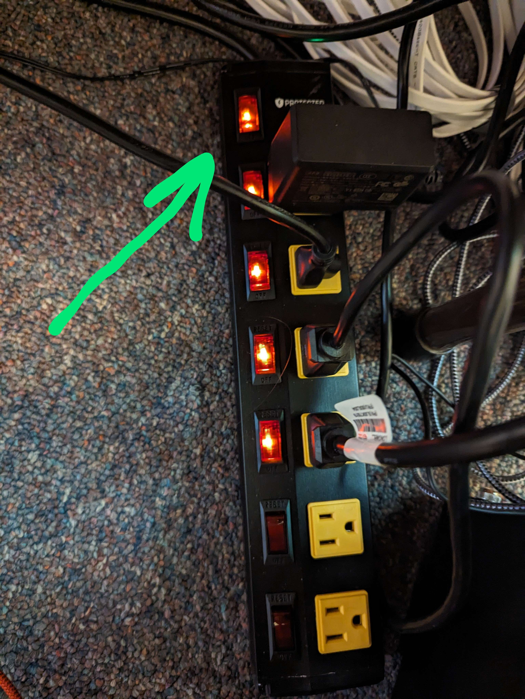
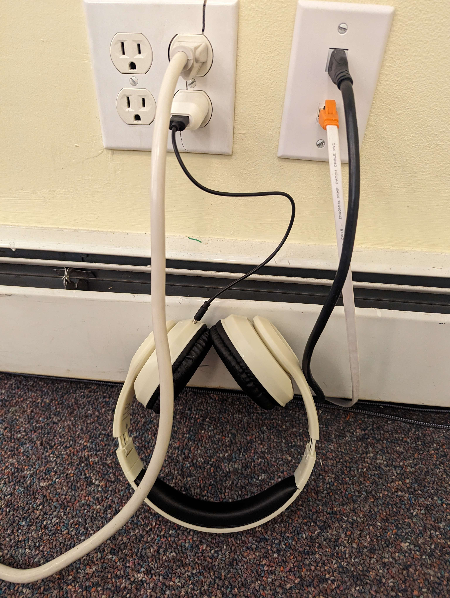

# Powering On

On arrival, here is a list of devices to power on in order to start the stream.

## Surge Protector

Under the computer there is a switched surge protector. Turn on the top switch to turn on all the plugs.

## Headphones (Bluetooth)

There is a pair of bluetooth headphones that will be plugged in to the wall. Unplug them and hold the power button to turn on if they are not blinking.

## Computer

You will find a computer under the desk press the power button to begin powering on.

The computer has a capture card under the desk that will automatically hook up and provide both the sound from the sound system and the video from the camera.

The computer also has its speakers hooked up to the sound system, it is input 1 on the soundboard.

## All 5 TV’s

You will find a remote on the table that will turn them on. Make sure to double check they are actually on, sometimes turning one on may turn another off accidentally.

## Camera

You will need to press the power button on the remote for the PTZ (pan tilt zoom) camera and wait for it to turn on.