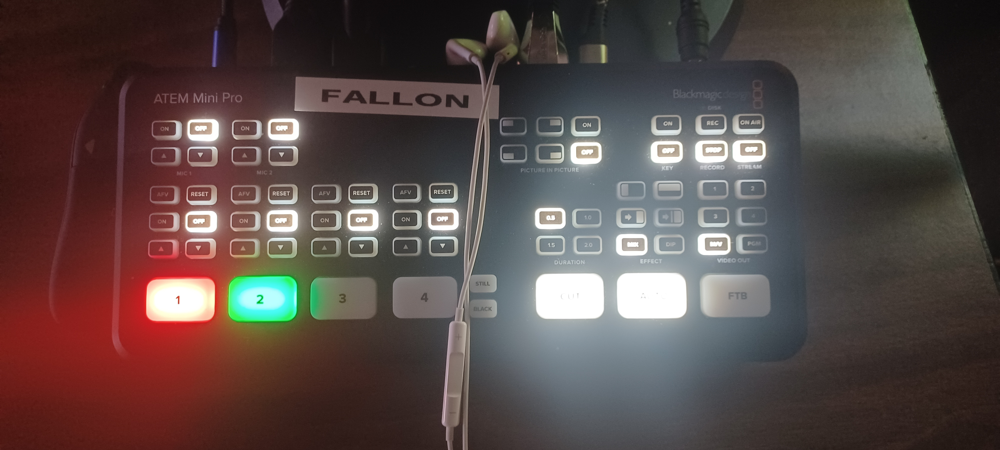

# Powering On

On arrival, here is a list of devices to power on in order to start the stream.

## All 5 TV’s

You will find a remote on the table that will turn them on. Make sure to double check they are actually on, sometimes turning one on may turn another off accidentally.

## Computer

You will find a computer under the desk press the power button to begin powering on.

## Cameras

There will be one or two cameras that need to be hooked up to the station. You will find a power cable and hdmi cable near each to plug in.

Camera Plugged In

Also, make sure to set relevant setting and zoom on each camera. For the most part the auto settings will work fine other than to zoom in each to the right level. We leave the right camera as a wide angle shot and the left camera we use to zoom in.

## Streaming Board

The streaming board just requires two button presses after turning on:

The “2” Button in order to prep it for switching between the first two inputs, and the “0.5” Button to set the delay for fading between inputs.

Afterwards, you will turn on the mic input 1 in the top left hand corner when streaming to bring in the audio input.